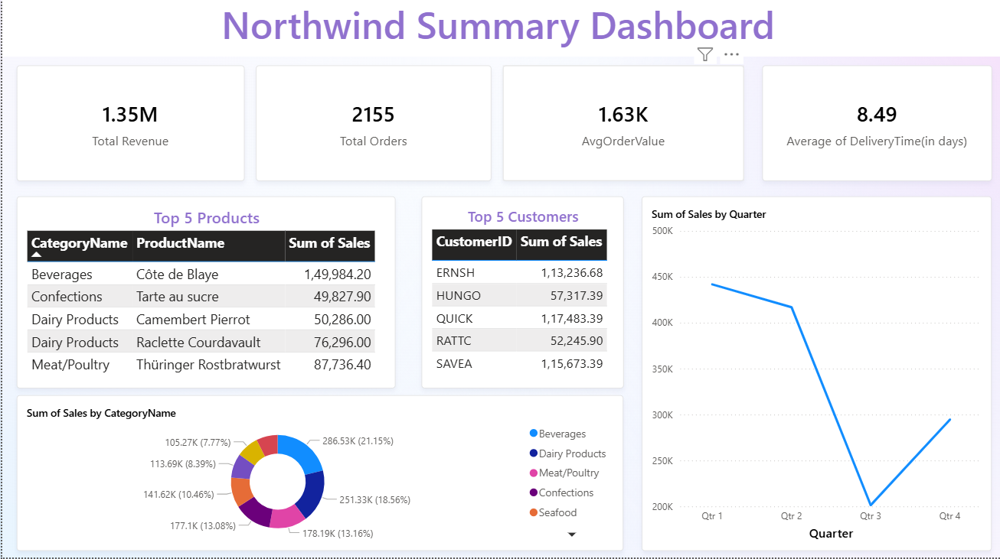
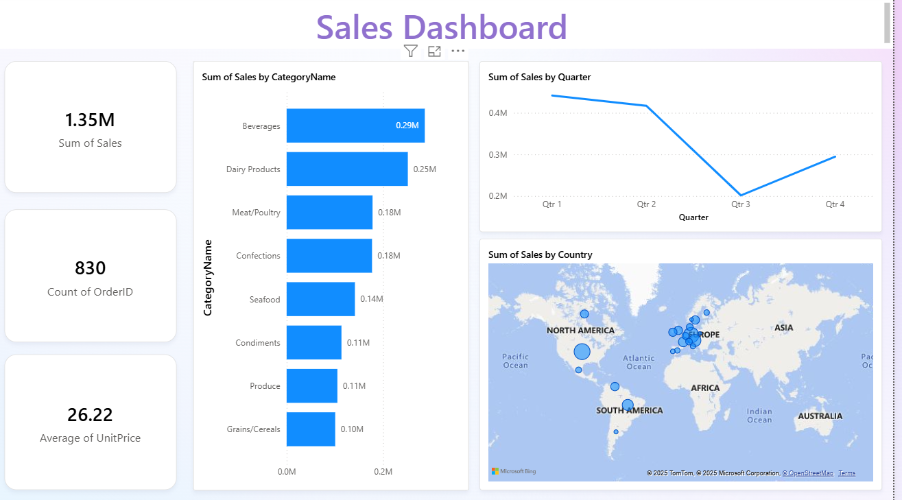
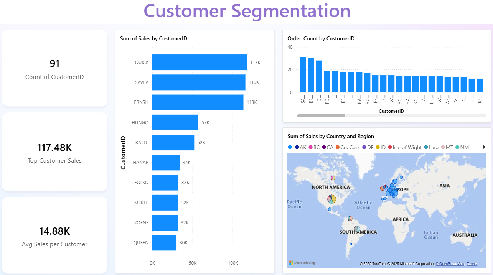
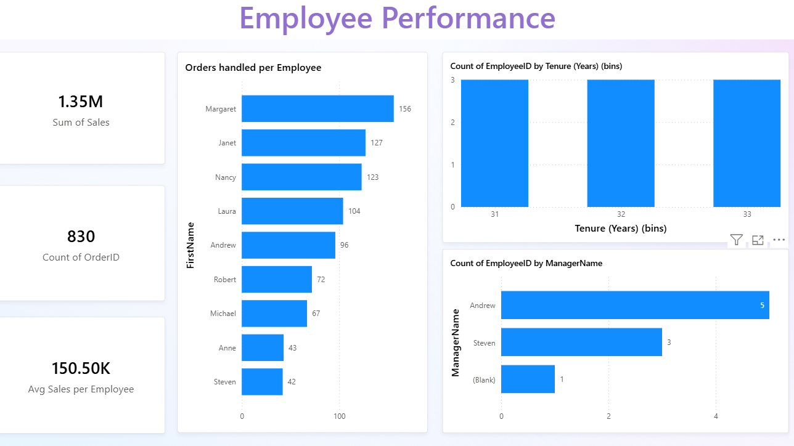

# Northwind Traders - Business Analytics Dashboard

A comprehensive Power BI dashboard analyzing sales data for strategic business insights.

## Project Overview

**Northwind Traders** is a specialty food import/export company analysis project using advanced SQL and Power BI to generate actionable business insights.

**Key Metrics:**
- **Revenue**: $1.35M across 830 orders
- **Customers**: 91 customers in 21 countries  
- **Top Categories**: Beverages ($286K), Dairy Products ($251K)
- **Average Order Value**: $1,630

## Database Tables

| Table | Records | Description |
|-------|---------|-------------|
| Customers | 91 | Customer information and locations |
| Orders | 830 | Order transactions |
| Order_Details | 2,155 | Product line items |
| Products | 77 | Product catalog (8 categories) |
| Employees | 9 | Sales team performance |

## Dashboard Screenshots

### Executive Summary Dashboard

### Sales Performance Analysis

### Customer Segmentation

### Employee Performance

## Key Business Insights

- **Top Customers**: QUICK-Stop ($117K), Save-a-lot Markets ($116K), Ernst Handel ($113K)
- **Seasonal Trends**: Q3 shows significant decline requiring targeted marketing
- **Employee Leader**: Margaret handles 156 orders (highest performance)
- **Inventory Alert**: 18 products need immediate restocking

## Technologies Used

- **SQL Server** - Advanced queries (CTEs, Window Functions)
- **Power BI** - Interactive dashboards and visualizations
- **Excel** - Supplementary analysis and reporting

## Key Features

- 6 interactive Power BI dashboards
- Advanced SQL analysis with business insights
- Customer segmentation and behavior analysis
- Sales performance tracking across categories
- Operational efficiency metrics

## Strategic Recommendations

1. **Customer Retention Program** for top 10 high-value customers
2. **Inventory Optimization** for 18 low-stock items  
3. **Geographic Expansion** in underperforming markets
4. **Seasonal Marketing** to address Q3 revenue decline

## Files Included

- `dashboards/` - Power BI dashboard files (.pbix)
- `sql-queries/` - Advanced SQL analysis queries
- `reports/` - Comprehensive business analysis report
- `images/` - Dashboard screenshots and visualizations

## Contact

**Rupesh Gupta** - rg603929@gmail.com 
**LinkedIn**: https://www.linkedin.com/in/rupesh-gupta-5b5b4022a/  
**Project Link**: https://github.com/rupeshg27/Northwind_Sales_Analysis

---

**Skills Demonstrated**: Advanced SQL, Power BI, Data Analysis, Business Intelligence, Strategic Planning

